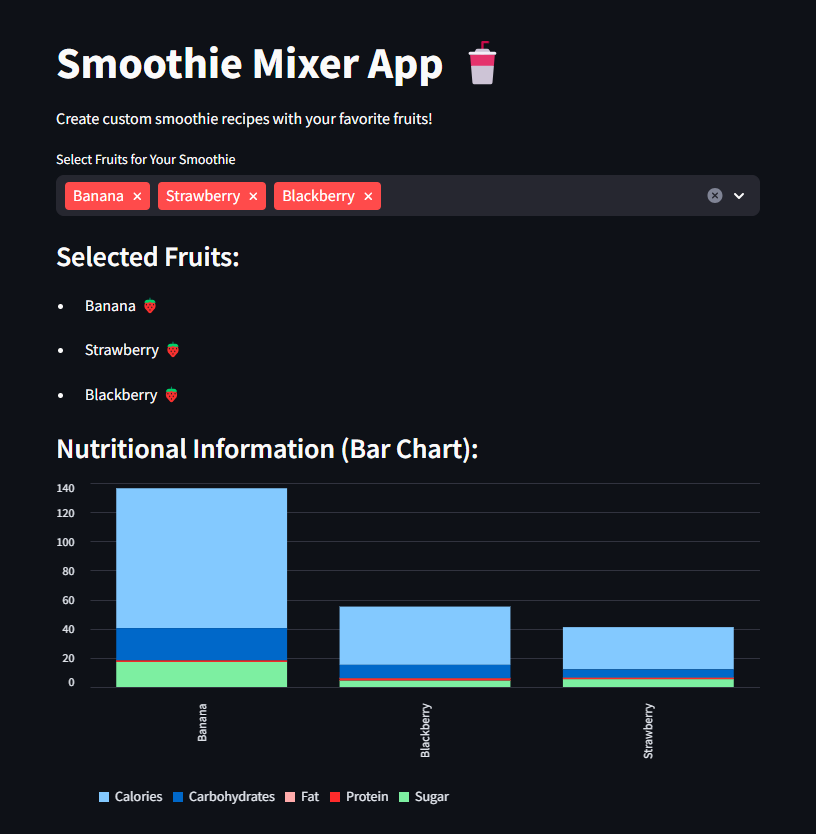
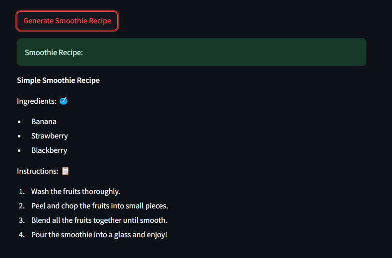

# Smoothie Mixer App 🥤

Create custom smoothie recipes with the Smoothie Mixer App! This Python-based web application, built using Streamlit, fetches nutritional data from the FruityVice API. Whether you're a smoothie enthusiast or just want to explore healthy and delicious fruit combinations, this app makes it easy.

## Features

- **Fruit Selection:** Choose your favorite fruits for your smoothie.
- **Nutritional Information:** Visualize nutritional data with an interactive bar chart.
- **Recipe Generation:** Generate simple smoothie recipes based on your selected fruits.

## Usage

1. Install dependencies:
   ```bash
   pip install -r requirements.txt

2. Run the app:
   ```bash
   streamlit run app.py

## Live Demo
http://3.106.58.191:8501/
   

## Screenshots


*Caption for Screenshot 1*


*Caption for Screenshot 2*


## Contributing
Contributions are welcome! If you have suggestions, bug reports, or feature requests, please open an issue.
